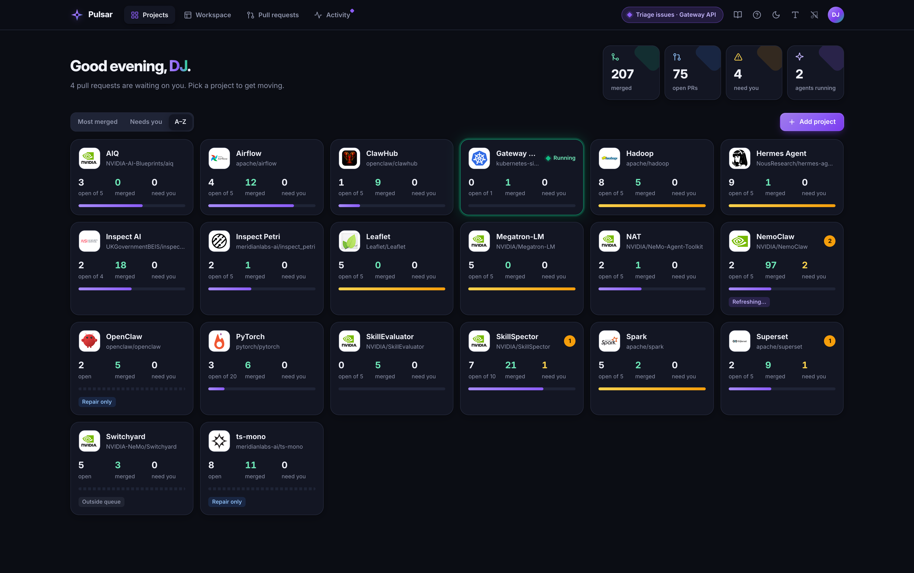

# Pulsar

Pulsar is an engineering system for AI coding agents that carries real work
from intent to verified delivery. It combines engineering principles,
decision rules, task-specific playbooks, project skills, durable task plans,
continuous learning from outcomes, concurrent specialist-agent coordination,
and evidence-driven verification.

Rather than only generating a patch, Pulsar helps an agent understand project
constraints, choose and execute the right work, learn from review outcomes,
launch and manage concurrent agents where useful, and deliver a clear receipt
of what was tested, what remains, and the next action.

## Pulsar-Assisted Contributions

These contributions were assisted by Pulsar.

## Bootstrapping Projects

These projects are in their initial contribution phase and do not yet have a
merged contribution.

| Project | Contributions | Open | Merged |
| --- | ---: | ---: | ---: |
|  <a href="https://github.com/NVIDIA-AI-Blueprints/aiq">AIQ</a> | [3](https://github.com/NVIDIA-AI-Blueprints/aiq/pulls/deepujain) | 3 | 0 |
|  <a href="https://github.com/NousResearch/hermes-agent">Hermes Agent</a> | [11](https://github.com/NousResearch/hermes-agent/pulls/deepujain) | 9 | 0 |
|  <a href="https://github.com/Leaflet/Leaflet">Leaflet</a> | [5](https://github.com/Leaflet/Leaflet/pulls/deepujain) | 5 | 0 |
|  <a href="https://github.com/NVIDIA/Megatron-LM">Megatron-LM</a> | [5](https://github.com/NVIDIA/Megatron-LM/pulls/deepujain) | 5 | 0 |
|  <a href="https://github.com/NVIDIA/OpenShell">OpenShell</a> | [1](https://github.com/NVIDIA/OpenShell/pulls/deepujain) | 0 | 0 |
|  <a href="https://www.schedmd.com/">Slurm</a> | [3](https://support.schedmd.com/buglist.cgi?email3=deepujain%40gmail.com&emaillongdesc3=1&emailtype3=substring&list_id=418332&product=Slurm&query_format=advanced&resolution=---) | 3 | 0 |

## Non-Pulsar Contributions

These contributions were not assisted by Pulsar.

| Project | Contributions | Open | Merged | Merged % |
|--------------|---------------|------|--------|----------|
|  <a href="https://github.com/apache/avro">Apache Avro</a> | [1](https://issues.apache.org/jira/browse/AVRO-1419) | 1 | 0 | 0.0% |
|  <a href="https://github.com/apache/druid">Apache Druid</a> | [1](https://github.com/apache/druid/pulls/deepujain) | 0 | 1 | 100.0% |
|  <a href="https://github.com/elastic/beats">Elastic Beats</a> | [2](https://github.com/elastic/beats/pulls/deepujain) | 0 | 2 | 100.0% |
|  <a href="https://github.com/eBay/oink">eBay Oink</a> | [1](https://github.com/eBay/oink/pulls/deepujain) | 0 | 1 | 100.0% |
|  <a href="https://github.com/eBay/nvidiagpubeat">nvidiagpubeat</a> | Creator and maintainer | — | — | — |
|  <a href="https://github.com/apache/pig">Apache Pig</a> | [2](https://issues.apache.org/jira/issues/?jql=key%20in%20(PIG-1885%2C%20PIG-671)) | 0 | 2 | 100.0% |
|  <a href="https://github.com/apache/zeppelin">Apache Zeppelin</a> | [6](https://github.com/apache/zeppelin/pulls/deepujain) | 0 | 0 | 0.0% |
|  <a href="https://github.com/NICTA/scoobi">Scoobi</a> | [2](https://github.com/NICTA/scoobi/pulls/deepujain) | 0 | 0 | 0.0% |
| **Total Contributions** | **15** | **1** | **6** | **40.0%** |

## Reusable Skill

This repo also includes a reusable
[OSS Contribution README skill](skills/oss-contribution-readme/SKILL.md) for
creating README files like this one.

Use it to build a polished OSS contribution showcase with verified GitHub PR
counts, tracker patch submissions, official project logos, linked totals,
featured contribution tables, and screenshot-friendly formatting.
